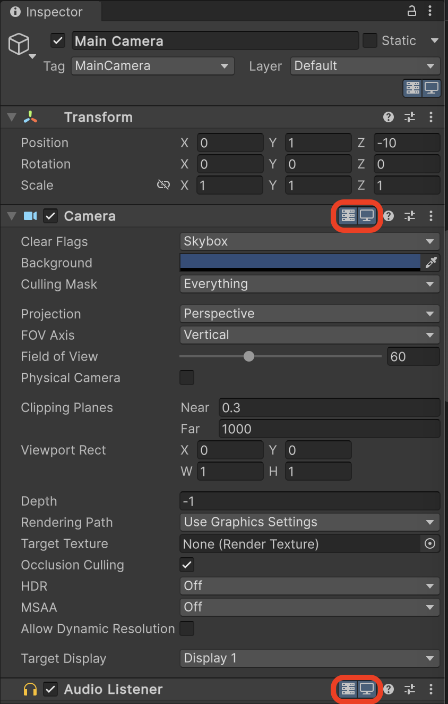

When building a [Dedicated Games Server](https://docs.unity3d.com/Manual/dedicated-server.html), content of a scene may differ between the client and server versions. For example, the cameras, rendering, and UI components may not be required on the server side, and server-related managers should not be included client side.

To optimize your builds, you can select what [GameObjects](#game-object-selection), [components](#component-selection), and [prefab assets](#prefab-asset-and-instance-selection) are present in different server build targets: **Standalone** or **Dedicated Server**. You can select each part of a scene to be stripped individually, by [search criteria](#selection-by-search), or [automatically](#automatic-selection) from the build target.

## GameObject Selection

You can choose the GameObjects and their children Unity automatically strips when building or entering play mode.

1. Open a scene.
2. In the **Hierarchy** window, select one or more GameObjects.
3. In the **Inspector** window, find the **Multiplayer Target** icons and pick **Dedicated Server** or **Standalone**. Hover over the icons for the tooltip explaining each button.

## Component Selection

You can choose the individual Components Unity automatically strips when building or entering play mode.

1. Open a scene.
2. In the **Hierarchy** window, select one or more GameObjects.
3. In the **Inspector** window, in the Component section of the GameObject, find the **Multiplayer Target** icons and pick **Dedicated Server** or **Standalone**. Hover over the icons for the tooltip explaining each button.

## Prefab Asset and Instance Selection

1. Open a scene.
2. Either select the **Prefab Asset** in the **Project** window or select a **Prefab Instance** in the **Hierarchy** window, and click **Open**. Changes in a **Prefab Instance** take precedence over those in the base **Prefab Asset**.
3. In the **Inspector** window, find the **Multiplayer Target** icons and pick **Dedicated Server** or **Standalone**. Hover over the icons for the tooltip explaining each button.

## Selection by Search

By using search, you can choose multiple GameObjects or prefab assets and instances Unity automatically strips when building or entering play mode.

1. Open a scene.
2. Open the [**Search** window](https://docs.unity3d.com/Manual/search-overview.html).
3. Search for the GameObjects to select (e.g. all renderers `t: Renderer`)
4. Select the GameObjects.
5. In the **Preview Inspector** panel, find the **Multiplayer Target** icons and pick **Dedicated Server** or **Standalone**. Hover over the icons for the tooltip explaining each button.

## Automatic Selection

You can choose the specific Components and subclasses that Unity automatically strips when building or entering play mode.

1. Go to **Edit** and select **Project Settings**.
2. Under the **Multiplayer** dropdown in the **Project Settings** window, select **Content Selection**.
3. From the **Server** tab, you can select to strip *Rendering*, *UI*, or *Audio* components.
4. Use the **Add** and **Remove** buttons to choose custom components to strip by name. You can also strip custom components on the **Client** tab.
5. Click on **Apply** after making your selections to save your changes.

When selecting the following preset options, Unity removes the corresponding components:

| Component Type | Corresponding Stripped Components |
|---|---|
| Rendering Components | <ul> <li>**Camera**</li> <li>**Light**</li> <li>All components inheriting from **Render**</li></ul> |
| UI Components | <ul> <li>All components in the `UnityEngine.UI` namespace</li> <li>All components in the `UnityEngine.EventSystems` namespace</li> <li>`UnityEngine.UIElements.PanelEventHandler`</li> <li>`UnityEngine.UIElements.PanelRaycaster`</li></ul> |
| Audio Components | <ul> <li>`UnityEngine.AudioSource`</li> <li>`UnityEngine.AudioLowPassFilter`</li> <li>`UnityEngine.AudioHighPassFilter`</li> <li>`UnityEngine.AudioReverbFilter`</li> <li>`UnityEngine.AudioListener`</li> <li>`UnityEngine.AudioReverbZone`</li> <li>`UnityEngine.AudioDistortionFilter`</li> <li>`UnityEngine.AudioEchoFilter`</li> <li>`UnityEngine.AudioChorusFilter`</li></ul> |